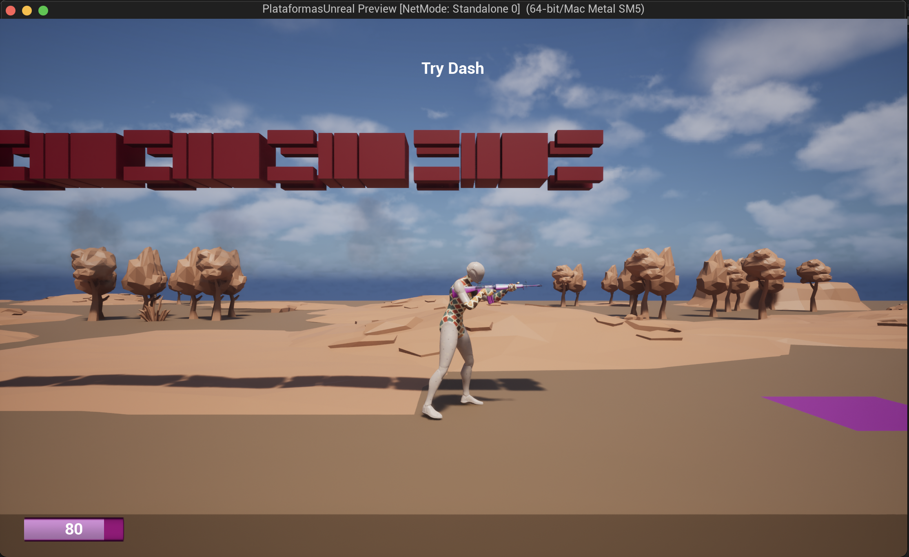

# Plataformas Unreal

Un prototipo de juego tipo plataformas lateral (2.5D) creado en Unreal, que incluye las siguientes características:

- Configuración para vista y movimiento 2,5D
- Uso de nuevas animaciones con apuntado (importando paquete, retargeting, etc.) y definición de blending animations (andar-correr, etc).
- Acacharse (variable, animaciones, blending para andar y correr acachado)
- Dash (con montage, particulas, al lanzarlo se desactiva y se recarga en 3 segundos mostrando un efecto visual)
- Disparo, sistema de daño y controla cuando el jugador se queda sin vida, indicando un game over, un efecto de partículas y reiniciando el último punto guardado.
- Alternar cámara del jugador y overview
- Torreta con disparo automático
- Plataformas móviles, con desplazamiento de ida y vuelta.
- Aspectos visuales de los actores. Añadidos efectos al disparar, colisionar, mallas, materiales, texturas.
- HUD: canvas (barra de vida, guardado, info contextual), menú de pausa, menú principal.
- Gestión de partidas guardadas (posición del player y vida)
- Diseño de nivel, donde se utilizan los actores creados y se aplican las mecánicas.

 